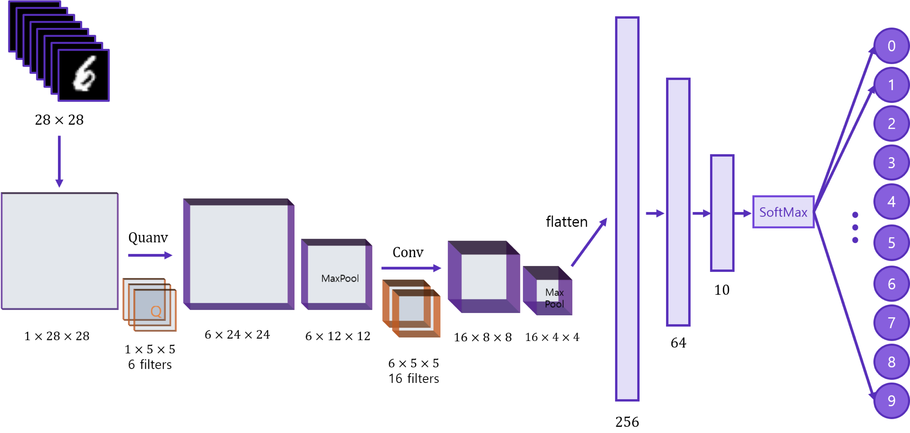
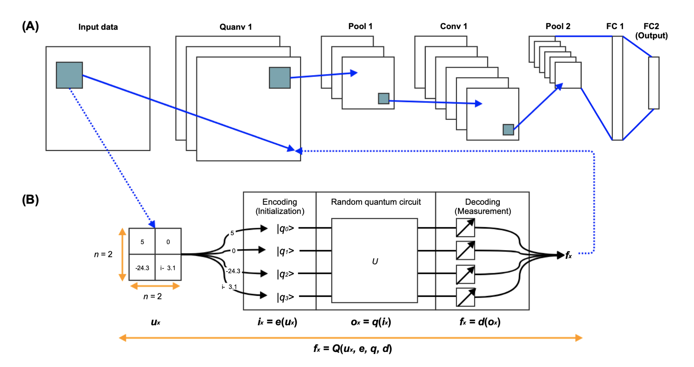

# quantum-neural-network 
## Exploring Hybrid quantum-classical Neural Networks with PyTorch and Qiskit
🎉**Qiskit Hackathon Korea 2021 : Community Choice Award Winner**🎉

### Team "Quanputing"
| name | github | role |
|-------|--------|---------|
|Kifumi Numata|[@kifumi](https://github.com/kifumi)|Coach, Qiskit Advocate|
|Anna Phan|[@attp](https://github.com/attp)|Coach, Qiskit Advocate|
|Dohun Kim|[@yh08037](https://github.com/yh08037)|Code development - model1/model2|
|Yunseo Kim|[@Yunseo47](https://github.com/Yunseo47)|Code development - model2, Presentation|
|Jaehoon Hahm|[@Jaehoon-zx](https://github.com/Jaehoon-zx)|Create presentation slides, Presentation|
|DaeHeon Yoon|[@Greathoney](https://github.com/Greathoney)|Code development - model1, Create presentation slides|
|Yoon Kwon|[@vhapfks](https://github.com/vhapfks)|Create presentation slides|
|Eunchan Lee|[@purang2](https://github.com/purang2)|Code development - model1|

### Model 1. [CNN with Quantum Fully Connected Layer](https://github.com/yh08037/quantum-neural-network/tree/master/model1-fc)

### Model 2. [CNN with Quantum Convolution Layer](https://github.com/yh08037/quantum-neural-network/tree/master/model2-conv)

## References
### Model 1. [CNN with Quantum Fully Connected Layer](https://github.com/yh08037/quantum-neural-network/tree/master/model1-fc)
- [Hybrid quantum-classical Neural Networks with PyTorch and Qiskit (Qiskit textbook)](https://qiskit.org/textbook/ch-machine-learning/machine-learning-qiskit-pytorch.html)
- [Gradients of parameterized quantum gates using the parameter-shift rule and gatedecomposition (arxiv)](https://arxiv.org/pdf/1905.13311.pdf)

### Model 2. [CNN with Quantum Convolution Layer](https://github.com/yh08037/quantum-neural-network/tree/master/model2-conv)
- [Quanvolutional Neural Networks (Pennylane demo)](https://pennylane.ai/qml/demos/tutorial_quanvolution.html)
- [arxiv-Quanvolutional Neural Networks: PoweringImage Recognition with Quantum Circuits (arxiv)](https://arxiv.org/pdf/1904.04767.pdf)
